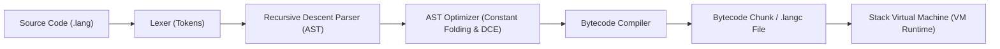

# Simple Compiler & Stack Virtual Machine

A clean, modular bytecode compiler and stack-based virtual machine implemented in Python.

It compiles a procedural scripting language down to compact bytecode instructions and executes them with a high-performance stack-based runtime featuring call frames, recursion, lexical scoping, compile-time optimizations, and built-in functions.

---

## Features

- **Lexical Analysis**: Full scanner supporting numbers, strings with escape sequences, booleans (`true`/`false`), nil (`nil`), comparisons (`==`, `!=`, `<`, `<=`, `>`, `>=`), logical operators (`and`, `or`, `not`), and both `#` and `//` comments.
- **Recursive Descent Parser**: Robust precedence parsing emitting rich AST structures with support for expressions, statements, blocks (`{ ... }`), loops (`while`, `for`), conditionals (`if`/`else`), function definitions, and collections (lists and dictionaries).
- **Compile-Time Optimization**: AST-level constant folding for arithmetic, string concatenations, and boolean logic, plus dead-code elimination for unreachable branches and loops.
- **Bytecode Compiler**: Translates AST nodes into bytecode chunks with local variable slot resolution, jump patching for control flow, and nested function compilation.
- **Lexical Closures & Upvalues**: First-class closures using Lua/Crafting Interpreters upvalues (`OP_CLOSURE`, `OP_GET_UPVALUE`, `OP_SET_UPVALUE`, `OP_CLOSE_UPVALUE`), supporting mutable captured state, multiple closures sharing identical upvalues, and arbitrary lexical nesting.
- **Object-Oriented Programming (OOP)**: Class declarations, constructor initializers (`init`), instance fields (`obj.field`), methods with `this` binding, first-class bound methods, single inheritance (`class Child < Parent`), and `super` method invocation.
- **Bytecode Serialization (.langc)**: Compiles source files into standalone `.langc` bytecode binaries with magic header validation for fast execution without re-parsing.
- **Stack-based Virtual Machine**: Fast execution loop with `CallFrame` stack management, recursion depth protection, operand stack balancing, and descriptive stack traces on runtime errors.
- **Disassembler**: Human-readable disassembly showing bytecode offsets, opcodes, constant pool references, closure upvalues, and jump targets.
- **Standard Library / Built-ins**: Native functions like `clock()`, `len()`, `str()`, `int()`, `float()`, `type()`, `append()`, `pop()`, `keys()`, and `values()`.
- **Interactive REPL & CLI**: Real-time evaluation preserving state, with inspection flags (`--disasm`, `--ast`, `--tokens`, `--analyze`, `-c`/`--compile`).

---

## Architecture



---

## Project Structure

```
simple-compiler/
├── src/
│   ├── __init__.py           # Package exports & public API
│   ├── tokens.py             # TokenType enum and Token dataclass
│   ├── lexer.py              # Lexical scanner
│   ├── ast_nodes.py          # AST node definitions & ASTVisitor
│   ├── parser.py             # Recursive descent parser
│   ├── optimizer.py          # AST constant folding & dead code elimination
│   ├── opcodes.py            # Bytecode opcode definitions
│   ├── chunk.py              # Instruction stream, constant pool & FunctionObject
│   ├── bytecode_compiler.py  # AST -> Bytecode compiler with local/global resolution
│   ├── serializer.py         # Bytecode serialization & deserialization (.langc)
│   ├── stdlib.py             # Standard library (math, file I/O, strings, system)
│   ├── vm.py                 # Stack Virtual Machine with CallFrames
│   ├── disassembler.py       # Bytecode disassembler
│   ├── interpreter.py        # Tree-walk AST interpreter (for dual-backend testing)
│   └── compiler.py           # Unified Compiler interface
├── examples/
│   ├── basic.lang            # Basic arithmetic and assignments
│   ├── control_flow.lang     # While loop, if/else, and block scoping
│   ├── fibonacci.lang        # Recursion and conditional branching
│   ├── functions_and_scopes.lang # Helper functions and native builtins
│   ├── collections_and_builtins.lang # Lists, dicts, indexing, and methods
│   ├── stdlib_demo.lang      # Math, string utils, and file I/O demo
│   ├── closures_demo.lang    # Lexical closures and shared upvalues demo
│   └── classes_demo.lang     # Classes, methods, inheritance, and super demo
├── tests/
│   ├── test_lexer.py         # Scanner unit tests
│   ├── test_parser.py        # Parser & precedence unit tests
│   ├── test_compiler.py      # Bytecode generation & local resolution tests
│   ├── test_vm.py            # VM execution, builtins & error handling tests
│   ├── test_collections.py   # Lists, dicts, and indexing unit tests
│   ├── test_optimizer.py     # Constant folding and DCE unit tests
│   ├── test_serializer.py    # Bytecode file serialization tests
│   ├── test_stdlib.py        # Standard library unit tests
│   ├── test_closures.py      # Lexical closures and upvalues unit tests
│   ├── test_classes.py       # Classes, instances, and inheritance tests
│   ├── test_basic.py         # Backward compatibility test suite
│   └── run_tests.py          # Unified test runner
└── main.py                   # CLI entrypoint and interactive REPL
```

---

## Usage

### Interactive REPL
```bash
python3 main.py
```

### Running a Program
```bash
python3 main.py examples/fibonacci.lang
```

### Compiling to Bytecode File (.langc)
```bash
python3 main.py -c examples/fibonacci.lang
# Compiles to examples/fibonacci.langc
```

### Running Compiled Bytecode Directly
```bash
python3 main.py examples/fibonacci.langc
```

### Disassembling Bytecode
```bash
python3 main.py --disasm examples/fibonacci.lang
```

### Interactive Step-Debugger
```bash
python3 main.py --debug examples/debugger_demo.lang
```

### Inspecting AST or Tokens
```bash
python3 main.py --ast examples/control_flow.lang
python3 main.py --tokens examples/basic.lang
```

---

## Language Syntax

### 1. Variables & Data Types
```javascript
let count = 42;
let pi = 3.14159;
let message = "Hello, world!";
let is_ready = true;
let nothing = nil;
```

### 2. Lists & Dictionaries
```javascript
// Lists and indexing
let numbers = [10, 20, 30];
numbers[1] = 25;
append(numbers, 40);
print numbers[0]; // 10
print len(numbers); // 4

// Dictionaries
let user = {
    "name": "Alice",
    "role": "engineer"
};
print user["name"];
user["role"] = "tech lead";
print len(keys(user));
```

### 3. Conditionals & Logic
```javascript
if (count > 50 and is_ready) {
    print "System active";
} else if (count == 42 or not is_ready) {
    print "The answer to life, the universe, and everything";
} else {
    print "Standby";
}
```

### 4. Loops
```javascript
// While loop
let i = 0;
while (i < 5) {
    print "Count: " + str(i);
    i = i + 1;
}

// For loop
for (let j = 0; j < 3; j = j + 1) {
    print "Loop: " + str(j);
}
```

### 5. Functions & Recursion
```javascript
fn fib(n) {
    if (n <= 1) {
        return n;
    }
    return fib(n - 1) + fib(n - 2);
}

print fib(10); // Outputs: 55
```

### 6. Lexical Closures & Upvalues
```javascript
// State encapsulation with closures
fn make_counter(start, step) {
    let count = start;
    fn next() {
        let current = count;
        count = count + step;
        return current;
    }
    return next;
}

let counter = make_counter(0, 5);
print counter(); // 0
print counter(); // 5
print counter(); // 10

// Shared mutable state across multiple closures
fn make_box(val) {
    let state = val;
    fn get() { return state; }
    fn set(v) { state = v; }
    return [get, set];
}

let b = make_box(10);
let getter = b[0];
let setter = b[1];
setter(42);
print getter(); // 42
```

### 7. Standard Library Built-ins
```javascript
// Math
print sqrt(144); // 12
print round(PI, 2); // 3.14
print max(10, 50); // 50

// String operations
let text = "  hello world  ";
print to_upper(trim(text)); // "HELLO WORLD"
let words = split(trim(text), " ");
print join(words, "-"); // "hello-world"

// File I/O
write_file("output.txt", "Hello from simple-compiler!");
let data = read_file("output.txt");
print data;
remove_file("output.txt");
```

### 8. Object-Oriented Programming (Classes & Inheritance)
```javascript
class Animal {
    fn init(name) {
        this.name = name;
    }

    fn speak() {
        return this.name + " makes a sound.";
    }
}

class Dog < Animal {
    fn speak() {
        return this.name + " barks: Woof!";
    }
}

class GoldenRetriever < Dog {
    fn speak() {
        return super.speak() + " (and wags tail)";
    }
}

let puppy = GoldenRetriever("Daisy");
print puppy.speak(); // "Daisy barks: Woof! (and wags tail)"

// First-class bound methods
let speak_fn = puppy.speak;
print speak_fn();
```

### 9. Interactive Step-Debugger & Breakpoints
The compiler includes a step-debugger with REPL inspection:
```javascript
fn compute(n) {
    let result = n * 2;
    debugger; // Embedded breakpoint statement pauses into the interactive debugger
    return result;
}

compute(10);
```

Run with `--debug`:
```bash
python3 main.py --debug script.lang
```

Available debugger commands:
- `step`, `s`: Step to next source line (steps into functions)
- `next`, `n`: Step over to next source line in current function
- `stepi`, `si`: Step single bytecode instruction
- `finish`, `fin`: Run until current function returns (step out)
- `continue`, `c`: Resume execution until next breakpoint or exit
- `break`, `b <loc>`: Set breakpoint at line (e.g. `b 12`) or function (e.g. `b compute`)
- `delete`, `d [id]`: Delete breakpoint by ID, or delete all if omitted
- `breakpoints`, `info b`: List all active breakpoints and hit counts
- `stack`: Inspect operand stack with types and values
- `frames`, `bt`: Inspect call stack frames and instruction pointers
- `locals`: Show local variables in the current frame
- `globals`: Show user-defined global variables
- `print`, `p <expr>`: Inspect variable or property (e.g. `p x`, `p user.name`)
- `disasm`, `dis`: Disassemble bytecode around current instruction pointer
- `list`, `l`: View source code context with pointer to current line
- `quit`, `q`: Cleanly abort execution and exit debugger
- `help`, `h`: Show help guide

---

## Running Tests

Run the complete test suite:
```bash
python3 tests/run_tests.py
```
