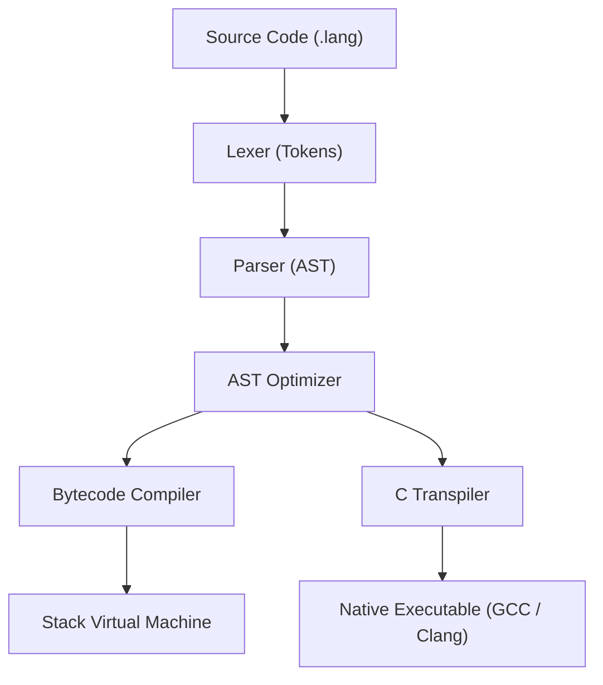

# Simple Compiler

A modular compiler and runtime for a procedural scripting language, featuring a stack-based bytecode virtual machine, an ahead-of-time (AOT) C transpiler, and an interactive step-debugger.

## Architecture



## Quick Start

```bash
# Start the interactive REPL
python3 main.py

# Run a source program
python3 main.py examples/fibonacci.lang

# Compile to standalone bytecode (.langc)
python3 main.py -c examples/fibonacci.lang
python3 main.py examples/fibonacci.langc

# Build standalone native executable via C backend
python3 main.py --build examples/native_demo.lang -o demo
./demo

# Run with interactive step-debugger
python3 main.py --debug examples/debugger_demo.lang
```

## Language at a Glance

```javascript
// Classes & Inheritance
class Animal {
    init(name) {
        this.name = name;
    }
    speak() {
        return this.name + " makes a sound.";
    }
}

class Dog < Animal {
    speak() {
        return super.speak() + " Woof!";
    }
}

// Closures & First-Class Functions
fn make_counter(start) {
    let count = start;
    fn increment() {
        count = count + 1;
        return count;
    }
    return increment;
}

// Collections & Standard Library
let puppy = Dog("Daisy");
print puppy.speak();

let counter = make_counter(10);
print counter(); // 11
print counter(); // 12

let list = [1, 2, 3];
append(list, 4);
print len(list); // 4
```

## Testing

Run the test suite across all compiler components:

```bash
python3 tests/run_tests.py
```
